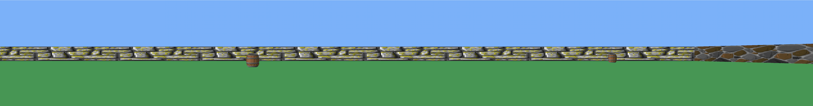

# CUB3D

### Firts graphics project in 3D. It is a raycasting algotithm to create a basic Wolfstein game. It manage sprites objects and diferent textures for each wall orientation. This is the old cub3D project currently it is a project to do by two students (before was an individual project), and they do not manage sprites and they do not need to capture the first image if execute with flag --save, this changes makes the new project easier than this one.

## How to play it?
#### Open your shell terminal and compile it with "make".
#### Execute in Shell "./cub3d testmap.cub". You can choose any other valid map from folder [maps](maps/validos/). In the map file you can change the resolution of the game changing the values of the R parameter. If one of this values are bigger than the screen size, it will go to the maxima resolution of the screen automaticaly.
#### Click on the new windows to enable the game if it is not open in fullscreen mode (it depends on the size you indicate in the map file).
#### You can walk around the map with the next keys:
#### · W: Go forward.
#### · S: Go Backward.
#### · A: Go to the left.
#### · D: Go to the right.
#### · LEFT ARROW: Turn the point of view to the left.
#### · RIGHT ARROW: Turn the point of view to the right.
#### As option you can capture the first image of the game executing "./cub3d testmap.cub --save" it is create an screenshot.bmp with the image, but you can not play it (that is the mandatory way to do it acording to the [subject](Subject/en.subject.pdf). If the flag --save is used, it must mantein the resolution indicate in the map file even if it is bigger than the screensize. 

#### Example of a capture of 6000x480 resolution.

#### You can change the texture files for each element, you can find more valid texture files in the folder [textures](textures/). If you want you can include your own texture file, to do it take care that must be xpm files, and with a size of 64 bits.

## Graded: 
